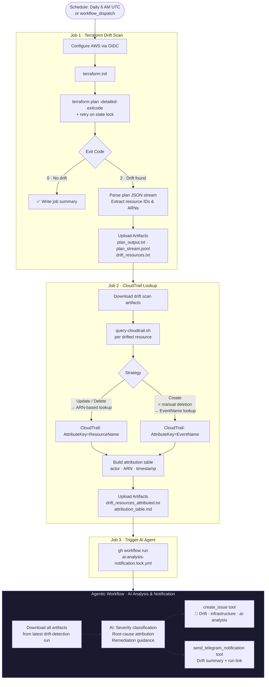
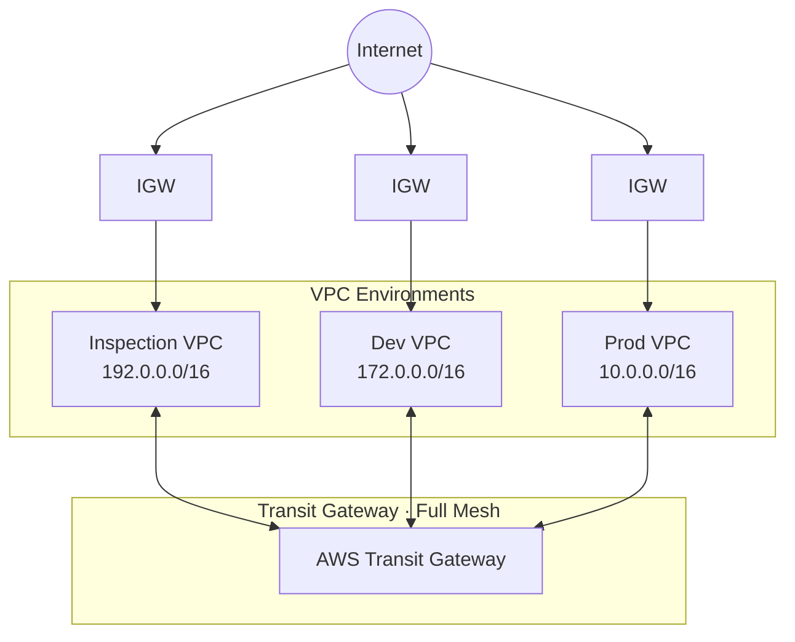

# AWS Infrastructure Drift Detection with GitHub Agentic Workflows

[](https://github.com/santhosh9349/gh_aw_drift_detection/actions/workflows/drift-detection.yml)
[](https://www.terraform.io/)
[](https://registry.terraform.io/providers/hashicorp/aws/latest)
[](LICENSE)

**Detect, attribute, and report AWS infrastructure drift automatically — powered by GitHub Agentic Workflows and AI analysis.**

This repository manages multi-VPC AWS infrastructure with Terraform and runs a daily agentic workflow that detects when AWS resources have been changed outside of Terraform, queries CloudTrail to find who made the change, and uses an AI agent to classify risk, create a GitHub issue, and send a Telegram notification.

---

## Table of Contents

1. [About GitHub Agentic Workflows](#about-github-agentic-workflows)
2. [Why Agentic Drift Detection](#why-agentic-drift-detection)
3. [How It Works](#how-it-works)
4. [Prerequisites](#prerequisites)
5. [Setup & Configuration](#setup--configuration)
6. [Infrastructure Architecture](#infrastructure-architecture)
7. [Project Structure](#project-structure)
8. [Contributing](#contributing)
9. [Getting Help](#getting-help)
10. [License](#license)

---

## About GitHub Agentic Workflows

[GitHub Agentic Workflows](https://github.github.com/gh-aw/) (`gh-aw`) extend standard GitHub Actions by embedding an AI agent directly inside a workflow step. Instead of scripting every decision, the agent receives context (artifacts, repository data, tool access) and autonomously decides what to do — such as creating a GitHub issue with a risk-classified analysis or triggering a Telegram notification.

> For a full overview of the platform, see the [GitHub Agentic Workflows documentation](https://github.github.com/gh-aw/).

This project uses the `gh-aw` CLI to compile a human-readable Markdown workflow definition ([`ai-analysis-notification.md`](.github/workflows/ai-analysis-notification.md)) into a locked, reproducible workflow file ([`ai-analysis-notification.lock.yml`](.github/workflows/ai-analysis-notification.lock.yml)).

**Key properties of Agentic Workflows used here:**
- `safe-outputs` — constrains what the agent can do (create one issue, send one notification)
- `tools` — grants GitHub toolsets (`actions`, `default`) so the agent can read artifacts
- `network: defaults` — restricts outbound traffic to a known-safe domain allowlist

---

## Why Agentic Drift Detection

Infrastructure drift — when live AWS resources diverge from their Terraform state — is hard to triage with static scripts alone because:

| Challenge | Classic Workflow Limitation | Agentic Solution |
|---|---|---|
| Severity varies by resource type | Script treats all drift identically | AI classifies risk (critical/high/medium/low) |
| Root cause requires context | Script reports _what_ changed | Agent correlates CloudTrail _who/when_ with plan diff |
| Issue quality degrades over time | Template issues go stale | Agent writes a fresh, context-aware issue each run |
| Multi-signal reasoning | Script can't join plan + audit data | Agent reads both artifacts together |

The agentic layer sits _after_ the deterministic data-collection jobs, so the structured pipeline remains reliable while the AI handles the judgment call on impact and remediation guidance.

---

## How It Works

The end-to-end pipeline is orchestrated by two workflows:

1. **`drift-detection.yml`** — deterministic data collection (Terraform plan → CloudTrail lookup → artifact upload → trigger agent)
2. **`ai-analysis-notification.lock.yml`** — agentic analysis (download artifacts → AI risk analysis → create GitHub issue → send Telegram notification)



### Artifact Chain

```
terraform plan (text + JSON stream)
        │
        ▼
drift_resources.txt          address | action | resource_type | identifier
        │
        ▼
drift_resources_attributed.txt   + actor_name | actor_arn | event_time
        │
        ▼
attribution_table.md         Markdown table for GitHub issue body
        │
        ▼
drift_report.json            Structured report for Telegram notification
        │
        ▼
Telegram message + GitHub Issue (AI-written)
```

---

## Prerequisites

### 1. Terraform Cloud

State is managed exclusively in [Terraform Cloud](https://app.terraform.io). Local state is prohibited.

- Create a Terraform Cloud organization and workspace linked to this repository
- Generate an API token: **User Settings → Tokens → Create an API token**
- Store it as the repository secret `TF_API_TOKEN`

### 2. AWS — Read-Only OIDC Role

The workflow authenticates to AWS using OpenID Connect (OIDC), read-only is enough for testing, more restrictive role for Organizational use.

Store the role ARN as the repository variable `AWS_OIDC_ROLE_ARN`.

### 3. GitHub Agentic Workflows — Copilot Token

The AI analysis step requires a GitHub Copilot-enabled token:

- Generate a **fine-grained personal access token** with `models: read` scope or use a GitHub App token
- Store it as the repository secret `COPILOT_GITHUB_TOKEN`

### 4. Telegram Bot

Follow [docs/drift-detection/telegram-setup.md](docs/drift-detection/telegram-setup.md) to create a bot via [@BotFather](https://t.me/botfather) and obtain the channel ID.

| Secret | Description |
|---|---|
| `TELEGRAM_BOT_TOKEN` | Token from BotFather (e.g., `1234567890:ABCdef...`) |
| `TELEGRAM_CHANNEL_ID` | Channel username (`@channel`) or numeric ID (`-100...`) |

### 5. Repository Variables

| Variable | Description | Example |
|---|---|---|
| `AWS_REGION` | AWS region for all operations | `us-east-1` |
| `AWS_OIDC_ROLE_ARN` | ARN of the read-only OIDC role | `arn:aws:iam::123:role/drift-readonly` |
| `TF_VERSION` | Terraform version to pin | `1.5.7` |

---

## Setup & Configuration

### 1. Clone & Install the gh-aw CLI

```bash
git clone https://github.com/santhosh9349/gh_aw_drift_detection.git
cd gh_aw_drift_detection

# Install the gh-aw GitHub CLI extension
gh extension install github/gh-aw
```

### 2. Configure GitHub Secrets and Variables

Navigate to **Settings → Secrets and variables → Actions** in your repository and add all secrets and variables listed in [Prerequisites](#prerequisites).

> For detailed guidance on configuring a repository for Agentic Workflows, refer to the [Agentic Authoring Guide](https://github.github.com/gh-aw/guides/agentic-authoring/).

### 3. Deploy the Terraform Infrastructure (optional)

The `terraform/dev/` directory contains a working multi-VPC environment used to demonstrate and test drift detection.

```bash
cd terraform/dev
terraform init          # connects to Terraform Cloud remote backend
terraform plan          # preview infrastructure changes
terraform apply         # provision resources
```

> State is managed remotely in Terraform Cloud. Never run `terraform apply` without first reviewing the plan output.

### 4. Trigger a Drift Check

```bash
# Manual trigger via GitHub CLI
gh workflow run drift-detection.yml --ref main -f environment=dev

# Or via the GitHub UI: Actions → Terraform Drift Detection → Run workflow
```

The workflow also runs automatically every day at **06:00 UTC**.

### 5. Editing the Agentic Workflow

The agent prompt lives in the human-readable source file. After editing, compile it:

```bash
gh aw compile .github/workflows/ai-analysis-notification.md
```

This regenerates `ai-analysis-notification.lock.yml`. Commit both files.

---

## Infrastructure Architecture

The Terraform configuration deploys a **Transit Gateway hub-and-spoke** network across three VPCs:



**Subnet naming convention (enforced by route table logic):**
- `pub_*` — public subnet: assigned public IPs, routed to Internet Gateway
- `priv_*` — private subnet: no public IPs, routed via Transit Gateway

**Scalability:** Add a new entry to `var.vpcs` in `terraform/dev/variables.tf`. All route tables, TGW attachments, and subnets are provisioned automatically via `for_each` — zero additional Terraform code required. See [terraform/dev/SCALABILITY_GUIDE.md](terraform/dev/SCALABILITY_GUIDE.md).

---

## Project Structure

```text
.
├── .github/
│   ├── workflows/
│   │   ├── drift-detection.yml              # Main drift detection pipeline
│   │   ├── ai-analysis-notification.md      # Agentic workflow source (editable)
│   │   └── ai-analysis-notification.lock.yml # Compiled agentic workflow (auto-generated)
│   ├── agents/                              # SpecKit agent definitions
│   └── copilot-instructions.md             # Repository-wide Copilot instructions
├── terraform/
│   ├── dev/                                # Dev environment — VPCs, subnets, TGW, EC2
│   │   ├── variables.tf                    # Add new VPCs here to scale
│   │   ├── SCALABILITY_GUIDE.md
│   │   └── TGW_CONNECTIVITY_GUIDE.md
│   └── modules/                            # Reusable modules: vpc, subnet, route_table, ec2, tgw
├── scripts/
│   └── drift-detection/
│       ├── query-cloudtrail.sh             # CloudTrail attribution (dual-strategy)
│       ├── generate-drift-report.sh        # Builds drift_report.json
│       ├── parse-terraform-plan.sh         # Extracts resource IDs from plan JSON stream
│       ├── notify_telegram.py              # Sends formatted Telegram message
│       ├── models.py                       # Pydantic models for drift report
│       └── requirements.txt               # Python deps (python-telegram-bot, pydantic, tenacity)
└── docs/
    └── drift-detection/
        └── telegram-setup.md              # Step-by-step Telegram bot setup
```

---

## Contributing

Enhancement contribution are welcome.

1. Fork the repository and create a branch from `main` or `dev`
2. For infrastructure changes: run `terraform fmt` and `terraform validate` before committing
3. For agentic workflow changes: edit the `.md` source and run `gh aw compile`
4. Open a pull request with a description of what changed and why

See [CONTRIBUTING.md](CONTRIBUTING.md) for the full guide and [CODE_OF_CONDUCT.md](CODE_OF_CONDUCT.md) for community standards.

---

## Getting Help

- **Workflow logs**: Navigate to **Actions → Terraform Drift Detection** in the GitHub UI
- **Telegram setup**: [docs/drift-detection/telegram-setup.md](docs/drift-detection/telegram-setup.md)
- **Bug reports / feature requests**: Open a [GitHub Issue](https://github.com/santhosh9349/gh_aw_drift_detection/issues)

---

## License

This project is licensed under the [MIT License](LICENSE).
