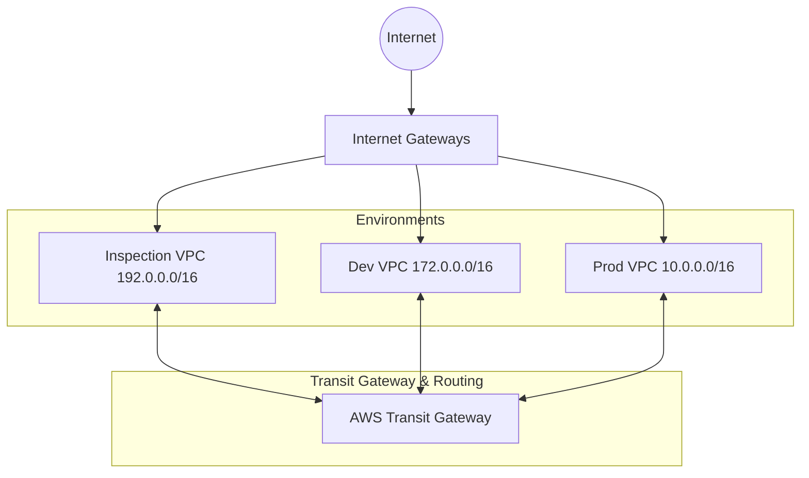
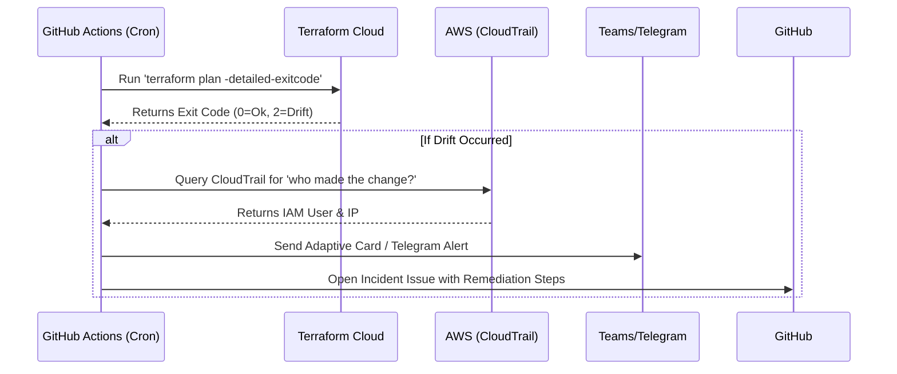

# AWS Infrastructure with Terraform & Automatic Drift Detection

[](https://github.com/santhosh9349/aws_infra/actions/workflows/drift-detection.yml)
[](https://opensource.org/licenses/MIT)

**A professional, production-grade repository for managing AWS Infrastructure using Terraform, complete with an advanced automated drift detection & remediation workflow.**

This repository contains IaC (Infrastructure as Code) configurations for deploying highly scalable multi-VPC AWS environments, featuring Transit Gateways (TGW), advanced routing, and rigorous security boundaries. It strictly adheres to GitOps best practices.

---

## ���️ Architecture Overview

The core architecture follows a **Transit Gateway hub-and-spoke** model for inter-VPC connectivity:



- **Fully Dynamic Scalability**: Scale from 3 to 100+ VPCs automatically without changing Terraform logic (simply update `var.vpcs`).
- **Isolation**: Workloads are deployed securely in private subnets, utilizing the Transit Gateway for mesh connectivity.

---

## ���️ Automated Drift Detection

The highlight of this repository is its robust **Drift Detection System**. Infrastructure drift occurs when resources exist in AWS differently than they are defined in Terraform. 



### Features:
- **Daily Automated Checks**: Runs every day to ensure parity between Terraform and AWS environments.
- **Attribution**: Automatically queries AWS CloudTrail to identify *who* made the manual change.
- **Alerting**: Rich Adaptive Cards sent to Microsoft Teams / Telegram channels.
- **Remediation**: Opens an actionable GitHub Issue with a raw diff and suggested steps (revert manual change or update Terraform).

---

## ��� Project Structure

```text
├── terraform/                # Terraform configurations for testing drift detection
│   ├── dev/                  # Dev environment configs
│   ├── prod/                 # Prod environment configs
│   └── modules/              # Reusable Terraform modules (vpc, ec2, tgw, etc.)
├── scripts/                  # Automation scripts (Drift parsing, Telegram/Teams API)
├── docs/                     # Extensive project documentation
└── .github/                  # GitHub workflows, Issue/PR templates, AI agents
```

---

## 🤖 AI-Assisted Workflow: Classic CI/CD Meets Agentic Analysis

This project represents a modern approach to infrastructure management by seamlessly integrating **classic GitHub workflows** with **agentic AI analysis**.

- **Agentic Analysis of CI/CD Outputs:** When our classic GitHub Actions drift detection workflow identifies an anomaly and opens an incident issue, our AI agents can step in to analyze the raw Terraform diffs and CloudTrail logs, automatically suggesting IaC remediations.
- **Instructions**: See `.github/copilot-instructions.md` and our custom `.github/agents/` for automated workflows.

---

## ��� Getting Started

### Prerequisites
- [Terraform](https://developer.hashicorp.com/terraform/downloads) >= 1.5.x
- Configured AWS CLI access & Terraform Cloud workspace

### Deployment
1. Navigate to an environment: `cd terraform/dev`
2. Initialize: `terraform init`
3. Preview changes: `terraform plan`
4. Deploy: `terraform apply`

*(Never manage state locally. State is exclusively tracked securely in Terraform Cloud).*

---

## ��� Contributing

We welcome contributions to both the infrastructure codebase and our automation scripts! Please review our repo health files:
- [CONTRIBUTING.md](CONTRIBUTING.md) for contribution guidelines.
- [CODE_OF_CONDUCT.md](CODE_OF_CONDUCT.md) for our standards.

---

## ��� License
This project is licensed under the [MIT License](LICENSE).
